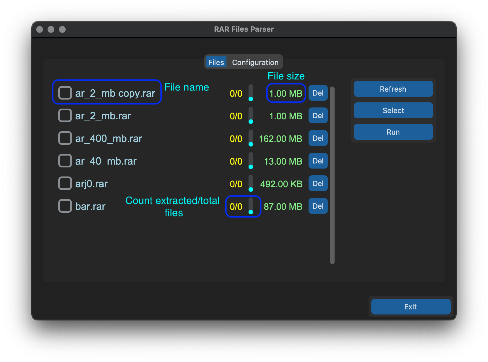
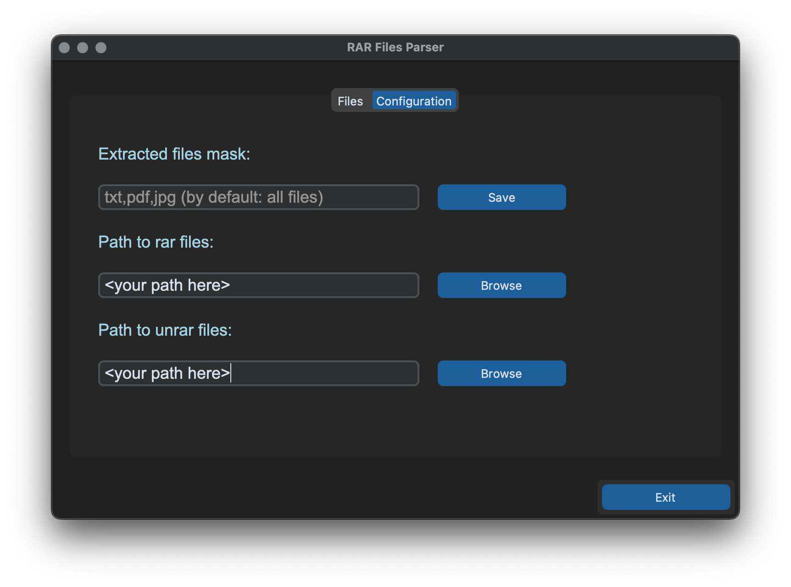

# GUI App for Extracting Files from RAR Archives by mask.


This GUI application is designed to facilitate the extraction of files from RAR archives based on user-defined criteria. It provides a user-friendly interface with two tabs: one for displaying the list of RAR files in a selected directory, and another for configuring extraction options.

### Features:

1. Work on Windows, Linux and MacOS systems.
2. Extracts files from RAR archives based on the user-defined criteria.

### Requirements:

This app use **[rarfile](https://pypi.org/project/rarfile/)** library for RAR file handling.
So make sure you have installed the **[RAR](https://www.rarlab.com/)** external tool.

Windows users must add WinRAR to the PATH environment variable.  
(For example, add `C:\Program Files\WinRAR\` to the PATH environment variable.)

### Main Window




### Configuration



### Installation:

1. Clone the repository:

   ```
   git clone https://github.com/kobzarchekg/parfile.git
   ```

2. Use poetry:

   ```
   poetry install
   poetry run App
   ```

3. Use pip:

   ```
   python -m venv .venv
   source .venv/bin/activate
   pip install -r requirements.txt
   python parfile/app.py

   ```
4.Use binnary app
[Releases](https://github.com/kobzarchekg/parfile/releases)

### Contributors:

- Alex Kobzar

### License:

This project is licensed under the MIT License - see the [LICENSE](LICENSE) file for details.

### Issues:

If you encounter any bugs or have suggestions for improvements, please feel free to open an issue [here](https://github.com/kobzarchekg/parfile/issues).

